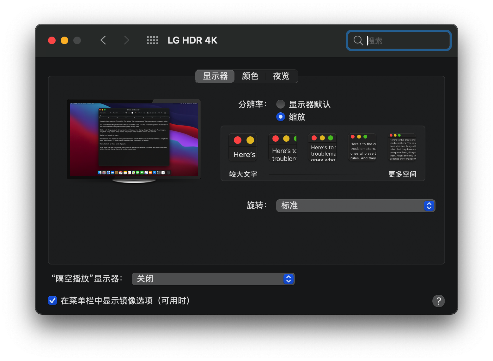

# OpenCore_for_HP600G2DM-6500
OpenCore_for_HP600G2DM-6500

```
Model              HP600G2DM
Mainboard          Intel Q150
CPU                Intel Core I5-6500
Memory             8G DDR4 2666MHz + 4G DDR4 2133MHz
Graphics           Intel HD Graphics 530
Audio              Realtek ALC221
Wifi               Bcm943224PcieBT2
Ethernet           Intel I219LM2 Ethernet
Monitor            4k 3840 x 2160
macOS Version      Bigsur 11.0 Beta(20A5384c)
OpenCore Version   0.6.1
```




